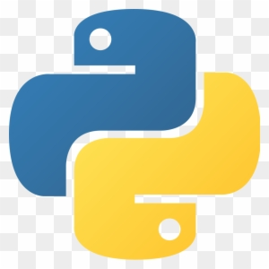

# 🐰 OP Bh-helper `v1.1.0`

<p align="center">
  
  
  
</p>

---


## 🎯 О проекте

**OP Bh-helper** — это легкий, полностью открытый (**Open Source**) и легитный ассистент для распрыжки (Bhop) в игре Counter-Strike 2. Программа написана с нуля на чистом Python с использованием стандартной графической библиотеки **Tkinter**.

> [!IMPORTANT]  
> **100% Безопасность и Чистота кода:** Скрипт не содержит скрытого мусора, майнеров или стилеров. Вся логика находится в одном открытом файле. Вы можете лично изучить каждую строчку кода перед запуском, переписать его под себя или скомпилировать самостоятельно.

### 🛡️ Как это работает?
В отличие от классических читов, этот софт:
* ❌ **НЕ** внедряется в память игры (No Inject / No Memory Write).
* ❌ **НЕ** изменяет и не читает файлы CS2.
* ✔️ **РАБОТАЕТ НА УРОВНЕ ОС:** Скрипт использует низкоуровневые функции Windows API (`GetAsyncKeyState` и `keybd_event`), имитируя нажатия реальной аппаратной клавиатуры. Для игры это выглядит так, будто вы очень быстро и вовремя жмете пробел сами.

---

## 🔥 Ключевой функционал


| Функция | Описание | Твоя выгода |
| :--- | :--- | :--- |
| **Zero Dependencies** | Код написан без внешних библиотек (`keyboard`, `pynput` и др.). | Запускается мгновенно, не требует прописывать `pip install` и не ломается из-за обновлений модулей. |
| **Продвинутый биндер** | Перехватывает сигналы напрямую из Windows. | Можно забиндить на абсолютно любую клавишу, включая **ЛКМ, ПКМ, колесико и боковые кнопки мыши (Mouse 4 / Mouse 5)**. |
| **Умный генератор кликов** | Динамическая частота ввода. | Софт выдает случайную скорость в диапазоне **от 100 до 140 нажатий в секунду (Гц)**. Никакой статичной цикличности. |
| **Human-Like алгоритм** | Встроенная система легитимизации. | Каждые несколько прыжков алгоритм берет случайную микро-паузу. Это ломает паттерн макроса, делая его поведение неотличимым от человека для казуальных античетов. |

---

## 💻 Структура проекта

Репозиторий максимально простой и чистый:
```text
├── .gitignore               # Игнорирование мусора Python
├── ChickenTomato.py         # Исходный код программы (Интерфейс + Логика)
└── README.md                # Документация, которую вы сейчас читаете
```

---

## 🚀 Инструкция по установке и запуску

### Вариант 1: Готовый `.exe` файл (Рекомендуется)
Если не хочется устанавливать Python и возиться с консолью:
1. Перейдите в раздел **[Releases](https://github.com/loanelly/OP-Bh-helper-for-CS2/releases)** на этом гитхабе.
2. Скачайте архив актуальной версии `v1.1.0`.
3. Распакуйте в любое место и запускайте `ChickenTomato.exe` **от имени Администратора**. 
   *(Права админа обязательны, иначе Windows заблокирует отправку пробела внутрь защищенного окна игры CS2).*

### Вариант 2: Запуск из исходного кода (Python)
Для тех, кто хочет контролировать всё лично:
1. Клонируйте этот репозиторий:
   ```bash
   git clone https://github.com
   ```
2. Откройте командную строку (cmd) **от имени Администратора** и перейдите в папку проекта.
3. Запустите скрипт напрямую через Python:
   ```bash
   python ChickenTomato.py
   ```

---

## 🎮 Как пользоваться в игре

1. При запуске по умолчанию уже выставлен бинд на **5-ю кнопку мыши (XBUTTON2)**.
2. Если нужно изменить кнопку: нажмите в интерфейсе **"Бинд"** и сразу кликните нужную клавишу на клавиатуре или мышке.
3. Нажмите зеленую кнопку **"ЗАПУСТИТЬ"** (статус программы сменится на *"Работает"*).
4. Сверните программу, заходите в CS2, зажимайте ваш бинд и летите по карте!

---

## ❓ Часто задаваемые вопросы (FAQ)

#### Вопрос: Меня забанит VAC / Faceit?
> **Ответ:** Софт проверялся в мм и премьер-режиме CS2 — бана нет, так как макрос работает через стандартное API операционной системы Windows и не лезет в игру. Однако, мы **НЕ рекомендуем** использовать этот софт на платформах с жестким клиентским античитом вроде Faceit, так как их системы могут блокировать любые искусственные зажатия клавиш на уровне ядра ОС.

#### Вопрос: Кнопка горит оранжевым "Нажмите любую кнопку...", но ничего не происходит.
> **Ответ:** Убедитесь, что вы нажимаете стандартную клавишу. Если вы нажимаете специфические мультимедийные кнопки (например, регулировку громкости на клавиатуре), Windows API может их не распознать.

---

## 🤝 Обратная связь и вклад в проект

Поскольку проект полностью **Open Source**, любые улучшения только приветствуются! 
* Нашли баг или хотите предложить фичу? Открывайте **[Issues](https://github.com/loanelly/OP-Bh-helper-for-CS2/issues)**.
* Хотите улучшить код или дизайн интерфейса? Буду рад вашим **Pull Requests**!

---

## ⚠️ Дисклеймер (Disclaimer)

Этот проект создан исключительно в ознакомительных целях, ради фана и для демонстрации возможностей работы графического интерфейса Tkinter с низкоуровневым вводом Windows API. Автор (`loanelly`) не несет никакой ответственности за ваши игровые аккаунты, возможные блокировки или внутриигровые санкции. Используйте софт с умом и на свой страх и риск.

<p align="center">
  Сделано с ❤️ руками <a href="https://github.com/loanelly">loanelly</a>.
</p>
